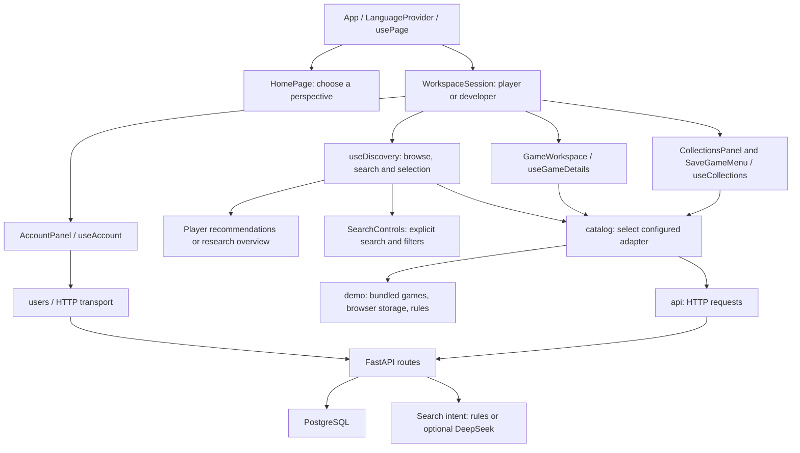

# Game Discovery Lens Architecture

Game Discovery Lens is a portfolio application demonstrating reliable search, account collections, and explicit AI integration. The current React/FastAPI/PostgreSQL application evolved from group coursework using Java Swing and SQL Server. The original implementation remains as project history.

## Current Application



The data mode is selected at page load by `?mode=demo` / `?mode=api`, or the frontend environment when no URL override is present. Switching modes reloads the page. An API failure stays an error and never switches the adapter or writes to demo storage.

The homepage has no catalog, account, collection, or insight effects. Entering a workspace mounts those behaviors; returning home unmounts them. Language preference, page perspective, and data mode are separate concerns. The player/developer choice does not grant account permissions.

## Frontend Responsibilities

| Module | Responsibility |
| --- | --- |
| `App.tsx` | Compose the header and chosen page; mount the account/discovery/collection session only inside a workspace and connect selected games to save controls. |
| `hooks/usePage.ts`, `components/HomePage.tsx` | Present player/developer entry choices and read native hash navigation. Keep public viewing perspective independent of account authorization. |
| `components/GameArtwork.tsx` | Render locally bundled, title-matched artwork with a neutral fallback; independent of game IDs, search, and AI interfaces. |
| `i18n/` | Own UI language preference, paired interface copy, display-only tag/error translation, and recognized catalog-content translation. Keep canonical identifiers, user drafts, and provider outputs intact. |
| `hooks/useAccount.ts` | Validate and retain the account session, perform login/register/logout, and reject stale authentication results. |
| `hooks/useDiscovery.ts` | Load/retry the catalog, coordinate search/filter results and selection, and accept only the latest search response. |
| `lib/recommendations.ts` | Select up to six catalog recommendations by rating, review count, then stable title/ID. Use the same ordering for initial selection and visible recommendation cards. |
| `lib/researchOverview.ts`, `components/ResearchOverview.tsx` | Aggregate the full loaded catalog, provide stable research references, and expose tag drilldowns. Keep overview statistics separate from selected-game and AI insight requests. |
| `hooks/useGameDetails.ts` | Load/retry one selected game's details and intelligence; ignore results for an earlier selection. |
| `hooks/useCollections.ts` | Own collection loading, mutations, saved games, and collection intelligence within an account/revision scope. |
| `components/AccountPanel.tsx` | Own login and registration form drafts and present account status. |
| `components/CollectionsPanel.tsx` | Own collection create/rename drafts and present collections and their intelligence. |
| `components/SaveGameMenu.tsx` | Own the selected game's save menu and create-and-save draft. |
| `components/SearchControls.tsx`, `components/GameWorkspace.tsx` | Present search/filter controls, selected details, matching games, and intelligence. |
| `services/catalog.ts` | Select the configured adapter once and expose the existing asynchronous operations to callers. |
| `services/catalog/api.ts` | Construct API requests, adding bearer authentication for collections and saves. |
| `services/catalog/demo.ts` | Implement browser collection storage, bundled catalog access, and sample search/insight behavior. |
| `services/catalog/contract.ts` | Describe the common operations implemented by both adapters. |
| `services/http.ts`, `services/users.ts` | HTTP/error handling and token/account requests. |

Form drafts belong to their panels; persisted state belongs to the hooks. The composition keys collection panels by account and session revision, and save menus additionally by game ID. Changing that context discards the old draft/menu without discarding unrelated discovery state. AccountPanel keeps a stable identity so authentication progress does not erase its inputs. The hooks independently prevent delayed requests from restoring old account or game data.

The adapter interface keeps existing caller inputs to preserve tested behavior. Demo operations use a browser user namespace and catalog input. API collection ownership comes exclusively from the bearer token; the API adapter does not transmit a client owner ID. Both adapters return promises, including when local storage throws, so callers use the same loading/error flow.

## Search and AI

Demo search and backend rules search share expected intents and result IDs in `tests/fixtures/search-contract.json`. Search combines a literal title fragment with requested filters. An absent budget is `maxPrice: null`. The backend performs filtering and ranking in PostgreSQL; the demo uses its fixed catalog.

Product conventions are explicit: free/free-to-play/免费 imposes `maxPrice: 0`; an explicit budget overrides the cheap/便宜 default of 35, while a free condition remains zero even alongside a budget. Cheap retains price-ascending ordering. Highly/top rated/高评分 means a minimum rating of 4.4, a positive review count, and rating-descending ordering. Known full titles and quoted phrases are extracted before their words can be interpreted as conditions. For example, `Fixture Highly Rated` remains a title search rather than a rating filter.

`useDiscovery` treats searches and manual filter changes as ordered operations. A late success or failure cannot replace a newer result. The detail module additionally checks game identity before exposing intelligence, preventing one game's delayed insight from appearing under another game.

The homepage leads to `#player` or `#developer`. The selected route supplies the discovery view, while the parsed search `mode` remains a query hint and does not navigate. A keyed workspace session unmounts when returning home or changing perspective, invalidating its pending responses. Saved collections and language preference persist through their existing stores; unsaved form drafts and the current search session do not persist across that navigation. No homepage choice modifies account roles or bearer-token ownership.

Both workspaces start in browsing with empty input and neutral search intent. The player view selects a recommendation; developer research starts with no selected game. Draft input does not change browsing; nonblank search or a filter change does. `resetBrowse` invalidates pending searches and restores each view's initial query/filter/selection state. Recommendation and research-reference ordering and overview aggregation are local reads of the full loaded catalog, without an AI request. Selected-game and collection insight loading continue through the existing hooks and providers.

The backend's optional DeepSeek search provider normalizes output into the same search contract. The prompt states the product conventions and includes catalog titles as data. After normalization, `apply_product_constraints` enforces recognized price, rating, and review conditions on the query with protected titles removed. A missing provider title constraint retains the rules parser's recognized title condition. SQLAlchemy then constructs the PostgreSQL filtering/ranking query. This boundary combines provider interpretation and application constraints; a `deepseek` result is an integration result, not an untouched model response.

Responses retain `source: rules` or `source: deepseek`. Disabled AI uses rules directly. Provider errors use rules when fallback is enabled, or return HTTP 503 when fallback is disabled. Blank search is resolved by the rules parser without a provider request. The title guard no longer adds `free` as a literal title fragment when it was recognized as a price condition.

Game and collection insight endpoints remain separate from search parsing. Current insight text is generated from metadata and aggregate statistics, not review source text. Collection intelligence requires the owning account. The interface preserves the supplied source and estimate labels. Recognized demo/rules content can be translated for display; external or unrecognized text is retained verbatim. Provider keys stay in backend configuration.

The [first live provider evaluation](verification/ai-evaluation-2026-09-15.md) exposed missing product thresholds and the title guard's handling of `free`; its reports remain unchanged. The [subsequent contract fixes and live rerun](verification/search-fixes-2026-09-16.md) record 31/31 passing nonblank integration cases against the original 24/31 baseline. An eight-query independent formulation set extends the boundary catalog; its original 7/8 report is retained alongside a separately explained correction of one authored expectation and an offline 8/8 rescore. Neither set establishes general held-out model accuracy.

The evaluation CLI uses the production resolver and SQL builder with isolated PostgreSQL schemas, separates fallbacks from provider successes, and caps explicit paid attempts. Search requests cap output at 1,024 tokens and disable thinking. The reports capture normalized, constrained intents and ordered SQL results, not raw response-quality metrics. Traceable review evidence and broader held-out evaluation remain future work.

## Backend and Persistence

FastAPI routes use SQLAlchemy models against PostgreSQL. Alembic migrations and the seed script provide reproducible setup. Collection and saved-game routes derive ownership from the authenticated account, reject missing/invalid sessions, and hide another account's collections. No server guest account is created by the browser demo.

Accounts use PBKDF2 password hashing and signed bearer tokens. The browser stores its token under the configured API URL and checks `/auth/me` when entering a workspace. A transient verification failure retains the stored token for retry; an invalid/expired session requires authentication again. Logout clears the browser token and current account state. It does not revoke an already issued token at the server; the token remains subject to its expiry and the active-account check.

Collection ownership is independent of the selected page perspective and never comes from a submitted user ID. Collection/save request bodies reject extra owner fields, and another user's collection returns 404. Saving the same game into the same collection is idempotent. Frontend account/revision guards keep late responses from restoring previous-account data or drafts.

The modern backend retains route/service boundaries while its search contract includes nullable literal title and price constraints. Alembic migrations describe the PostgreSQL schema; the legacy SQL Server migrations live separately in the repository root `migrations/` directory.

## Verification Seams

Tests call the same catalog exports as application hooks; adapter internals are not a second testing interface. App tests exercise search ordering and the actual account/collection controls, while hook tests cover failure handling and account changes. Backend integration tests use isolated UUID-named PostgreSQL schemas. GitHub Actions runs backend tests with PostgreSQL, frontend tests, and a production build.

Shared search fixtures check intent and results in the frontend parser and the PostgreSQL HTTP suite. UI coverage also exercises homepage navigation, recommendation and overview entry states, bilingual rendering, and provider/source presentation. Automated provider tests use controlled responses rather than a live paid service.

See the [API workflow and delivery](verification/api-delivery-2026-09-15.md), [collection](verification/collections-2026-09-14.md), [search](verification/search-2026-09-14.md), and [module refactor](verification/modules-2026-09-15.md) records for executed checks and limitations. The [entry](verification/entry-2026-09-15.md), [recommendation](verification/recommendations-2026-09-15.md), [research overview](verification/research-overview-2026-09-15.md), and [bilingual](verification/bilingual-2026-09-15.md) records cover the subsequent interface work.

## Legacy Coursework

```text
Java Swing UI -> JDBC -> SQL Server stored procedures and tables
TypeScript population scripts -> CSV import -> SQL Server
Playwright scraper -> CSV seed data
```

The legacy application contains marketplace behavior including users, reviews, purchases, bundles, vouchers, and folders. Its SQL Server migrations and stored procedures remain historical implementation evidence. Running the modern demo does not depend on the original school database or running the Java application.
